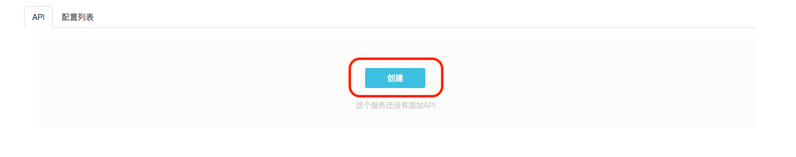
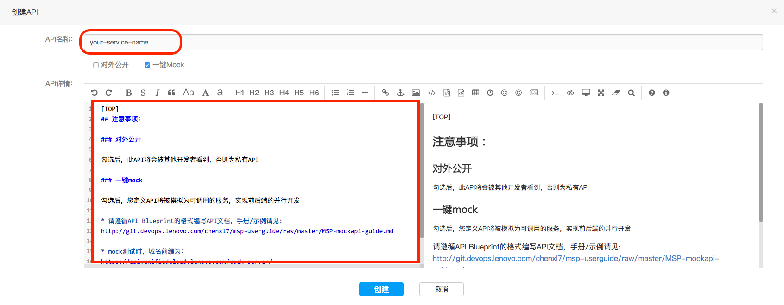
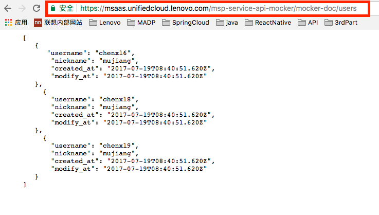
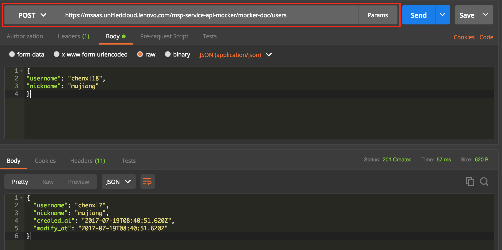
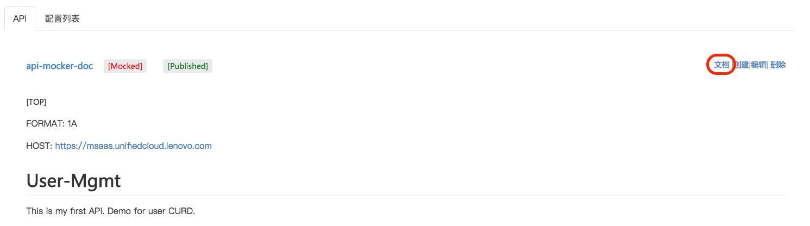
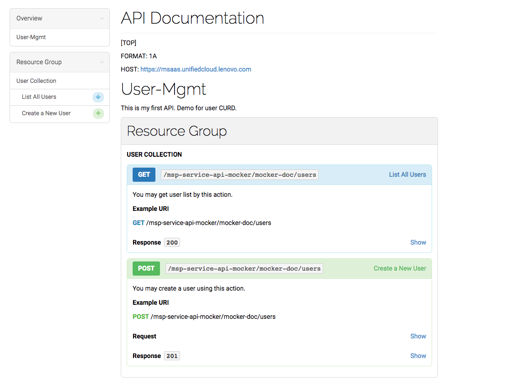

# Mock API 使用文档

### 注意事项： 
    
由于api-blueprint对格式要求比较严格，请务必注意以下限制：

    - 请勿使用Tab键表示下一级缩进，请使用4个空格代替。
    - 文档结尾，请以以下内容结尾，否则最后一个API调用时将返回错误的内容。

```    
+ 
[END]
```


### 1. 创建API，并勾选一键Mock

  
 
--- 

### 2. 填写API name和API设计文档

  

* 注： 
    - 请基于api-blueprint的格式编写API设计文档，官方教程：https://github.com/apiaryio/api-blueprint/blob/master/Tutorial.md 
    - 请勿使用Tab键表示下一级缩进，请使用4个空格代替。
    - 文档结尾，请以以下内容结尾，否则最后一个API调用时将返回错误的内容。

        ```    
        + 
        [END]
        ```

* 建议直接在DEMO的基础上进行修改，[点此查看](http://git.devops.lenovo.com/chenxl7/msp-userguide/raw/master/MSP-mockapi-demo.md) demo文档。 

---

### 3. 创建后，可查看文档和进行模拟调用。

* mock成功后请使用域名https://msaas.unifiedcloud.lenovo.com 进行测试及模拟调用

 

 

* 还可以查看生成的可读性强的文档

 

---

 


