# MSP用户手册

---
## <a name="outline"></a>大纲/目录

* [快速入门](#quickstart)
	* 联想微服务平台 
		*  [MSP简介](#introduction)
		*  [平台架构](#arc)
	* 新手上路
		*  [总体流程](#flow)
		*  [创建应用](#app-new)
		*  [管理应用](#app-mgmt)

*  [微服务开发文档](#dev-doc)
	*  [创建微服务](#service-new)
	*  [API Mock](#service-api-mock)
	*  [开发微服务](#service-dev)
		* 创建项目及初始化配置
		* 维护远程配置文件
		* 编写微服务代码
		* 维护微服务部署信息
		* 微服务注册地址及访问方式
	*  [提交及管理代码](#code-mgmt)
	*  [构建及发布](#service-online)
	*  [更新微服务/版本管理](#service-update)
	*  [下线微服务](#service-offline)
	*  [kibana使用](#kibana-use)
	*  [查看或监控微服务状态] (#service-monitor)
	*  [对异构语言及非Spring Boot框架项目的支持] (#service-non-java)

* [微服务使用文档](#call-doc)
	*  [申请微服务](#service-apply)
	*  [使用微服务](#service-call)
		* http调用
		* 服务间调用
* [帮助与支持](#help-doc)
	* 技术支持
	* 技术博客
	

---

## <a name="quickstart"></a> 快速入门

### 联想微服务平台

#### <a name="introduction"></a> MSP简介


联想微服务平台（Micro Service Platform : MSP）旨在提供一个集开发、测试、运维于一体的开发者专属平台，让开发者能快速构建或使用微服务，让开发更简单，让运维更高效。

MSP采用业界领先的Spring Cloud开源技术方案和一系列配套的分布式服务框架套件，可实现服务的快速部署发布、扩展、路由、注册与发现、立体化监控、日志管理、配置管理等能力。 


#### <a name="arc"></a> 平台架构

 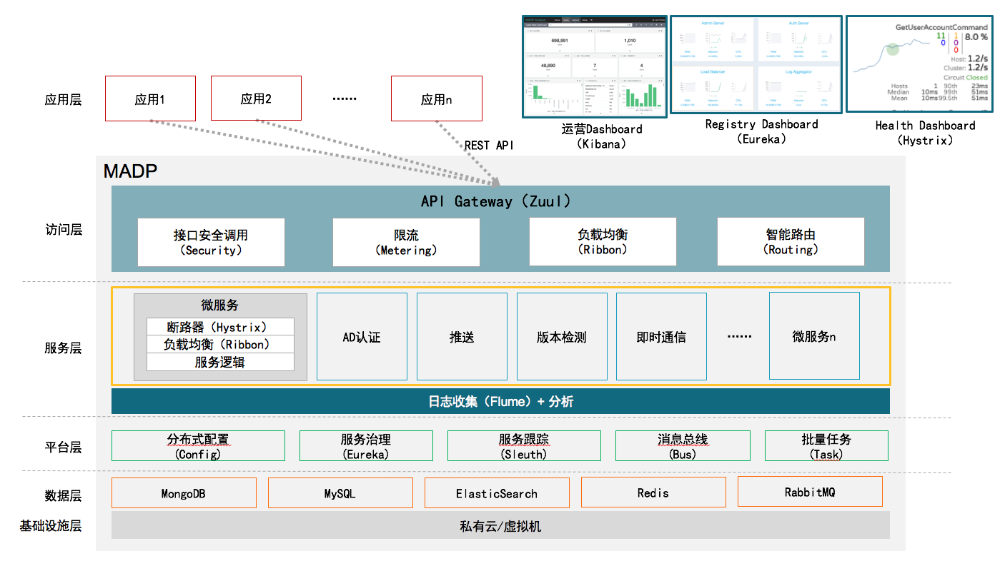 


### 新手上路

#### <a name="flow"></a>总体流程：


 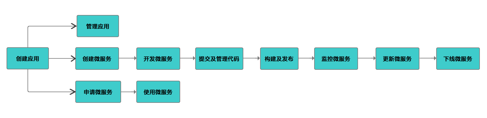 


#### <a name="app-new"></a> 创建应用    

在微服务网站`首页`上，输入应用的App Name，创建应用。在该应用内，您可以创建属于该应用的微服务，也可以消费其他应用开放的微服务。

 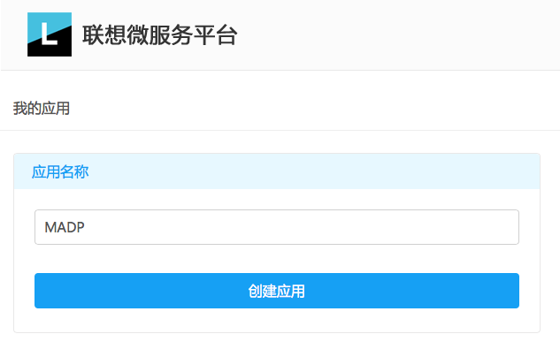

在应用的`基本信息`页，您将看到AppKey、ClientID、ClientSecret信息。AppKey为此微服务在MSP的唯一标识。ClientID与ClientSecret相当于管理员账号与密码，请妥善保管以免泄露。

 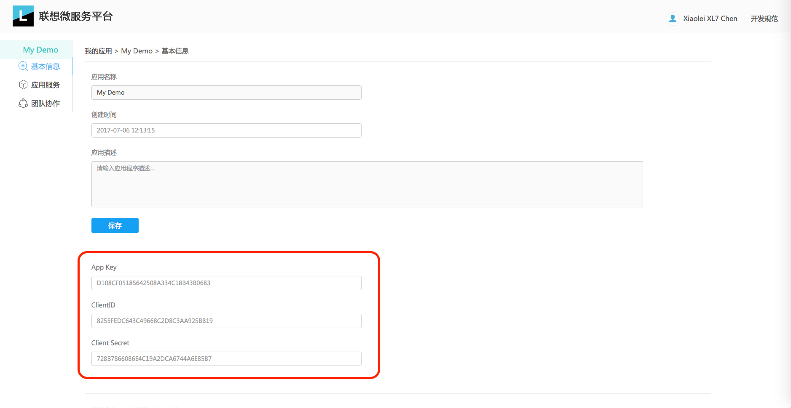

* 如果您需要开发并开放微服务，请查看 [微服务开发文档](#dev-doc)
* 如果您需要使用微服务，请查看 [微服务使用文档](#call-doc)


#### <a name="app-mgmt"></a> 管理应用

* 您可以将您的应用删除或转移给他人，进入`基本信息`页，进行操作。


* 您也可以和团队成员一起管理应用，在`团队协作`页，可以添加团队成员。也可以将团队成员设为管理员，管理员有权限对该应用下的微服务信息进行修改。


 --- 


## <a name="dev-doc"></a>微服务开发文档   [](#outline)  


 
### <a name="service-new"></a>创建微服务

点击`应用服务`进入服务列表页，点击右侧`创建新服务`按钮，输入微服务的服务名称，即ServiceName(请参考下面的微服务命名规范)、显示名称、服务描述，点击“提交按钮”以创建微服务。创建完成后在微服务详情页，您将获得ServiceKey，ServiceKey是此微服务的唯一标识。

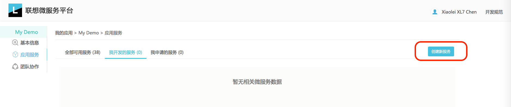

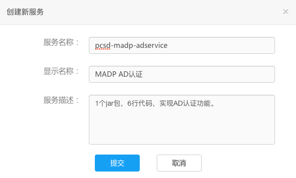 


##### 微服务命名规范：

微服务名称（ServiceName）采用三段式的命名规则，中间使用中横线分隔，即`xxxx-xxxx-xxxx`形式。

	1) 一级服务名为组织名称，如pcsd，二级服务名为应用或项目的名称，如madp，三级服务名为功能模块的名称，如auth。整体为pcsd-madp-auth
	2) 使用英文拼写，单词间不要使用空格和`_`。
	3) 请全部使用小写字母。 

正例：

	pcsd-madp-auth
	pcsd-msp-ovp-order

反例：

	pcsd madp auth 	   [错误说明：格式错误]
	pc_sd-madp-auth    [错误说明：空格，下划线]
	pcsd-MADP-auth     [错误说明：大写]


### <a name="service-api-mock"></a> API  Mock

API Mock是一款API协同设计、快速生成文档、即时API模拟的工具。

它能把按一定的语法编辑的API文档，模拟成真实可调用的服务；还能生成界面优美，可读性强的文档。

有了此利器，前后端的小伙伴就可以并行开发。前端开发的小伙伴再也不用苦等, 后端开发的小伙伴再也不用被催啦~

[点此查看](http://git.devops.lenovo.com/chenxl7/msp-userguide/blob/master/MSP-mockapi-guide.md) 详细的手册。

  
### <a name="service-dev"></a>开发微服务   
#### 创建项目及初始化配置

您可以通过2种方式创建项目：1）通过IDE创建maven项目；2） 下载 [demo](http://git.devops.lenovo.com/zhangyj21/msp-demo) 项目，导入IDE并修改。
	
1.通过IDE创建maven项目

1）修改父pom文件：

修改父pom文件，并粘贴以下内容，或直接[点此查看](http://git.devops.lenovo.com/liyf23/msp-pom/raw/master/pom.xml)此pom文件。


```xml

<project xmlns="http://maven.apache.org/POM/4.0.0" xmlns:xsi="http://www.w3.org/2001/XMLSchema-instance"
         xsi:schemaLocation="http://maven.apache.org/POM/4.0.0 http://maven.apache.org/xsd/maven-4.0.0.xsd">
    <modelVersion>4.0.0</modelVersion>
    <parent>
        <groupId>org.springframework.boot</groupId>
        <artifactId>spring-boot-starter-parent</artifactId>
        <version>1.5.4.RELEASE</version>
        <relativePath/> <!-- lookup parent from repository -->
    </parent>
    <groupId>com.lenovo</groupId>
    <artifactId>msp</artifactId>
    <version>1.0</version>
    
	 <!-- 注意：如果项目分模块，或者使用了父子pom，那么父pom中的packaging配置项请设置为pom格式 -->
    <name>Micro Service</name>
    <description>Micro Service Platform</description>
    <url>https://github.com/codecentric/spring-boot-admin/</url>
    <packaging>pom</packaging>

	<developers>
		<developer>
			<name>msp</name>
			<email>msp@lenovo.com</email>
			<organization>Lenovo Micro Service Platform </organization>
		</developer>
	</developers>
    <!-- Inherit defaults from Spring Boot -->

    <!--初始化一些系统的配置参数，所有子项目共用-->
	<properties>
		<project.build.sourceEncoding>UTF-8</project.build.sourceEncoding>
		<project.reporting.outputEncoding>UTF-8</project.reporting.outputEncoding>
		<java.version>1.8</java.version>
		<spring-cloud.version>Dalston.RELEASE</spring-cloud.version>
	</properties>

    <!--所有子项目共同依赖-->
	<dependencies>
        <dependency>
            <groupId>org.springframework.boot</groupId>
            <artifactId>spring-boot-starter</artifactId>
        </dependency>
        <!--Full-stack web development with Tomcat and Spring MVC-->
        <dependency>
            <groupId>org.springframework.boot</groupId>
            <artifactId>spring-boot-starter-web</artifactId>
        </dependency>
        <!--Production ready features to help you monitor and manage your application-->
        <dependency>
            <groupId>org.springframework.boot</groupId>
            <artifactId>spring-boot-starter-actuator</artifactId>
        </dependency>
        <!--API documentation for the Actuator endpoints-->
        <dependency>
            <groupId>org.springframework.boot</groupId>
            <artifactId>spring-boot-actuator-docs</artifactId>
        </dependency>
        <!--Circuit breaker with spring-cloud-netflix Hystrix-->
        <dependency>
            <groupId>org.springframework.cloud</groupId>
            <artifactId>spring-cloud-starter-hystrix</artifactId>
        </dependency>
		<dependency>
			<groupId>org.springframework.boot</groupId>
			<artifactId>spring-boot-starter-test</artifactId>
			<scope>test</scope>
		</dependency>
	</dependencies>


    <!--依赖管理-->
    <dependencyManagement>
        <dependencies>
            <dependency>
                <groupId>org.springframework.cloud</groupId>
                <artifactId>spring-cloud-dependencies</artifactId>
                <version>${spring-cloud.version}</version>
                <type>pom</type>
                <scope>import</scope>
            </dependency>
        </dependencies>
    </dependencyManagement>

	<build>
		<plugins>
            <!-- Package as an executable jar -->
            <plugin>
                <groupId>org.springframework.boot</groupId>
                <artifactId>spring-boot-maven-plugin</artifactId>
                <configuration>
                    <executable>true</executable>
                </configuration>
            </plugin>
		</plugins>
	</build>

    <!--maven仓库地址-->
    <distributionManagement>
        <!-- 配置快照版本发布的仓库 -->
        <snapshotRepository>
            <id>msp-snapshots</id>
            <name>Madp Snapshots Repository</name>
            <url>http://10.96.83.23:8082/nexus/content/repositories/msp-snapshots/</url>
        </snapshotRepository>
        <!-- 配置release版本发布的仓库 -->
        <repository>
            <id>msp-releases</id>
            <name>Madp Releases Repository</name>
            <url>http://10.96.83.23:8082/nexus/content/repositories/msp-releases/</url>
            <uniqueVersion>false</uniqueVersion>
        </repository>
    </distributionManagement>
</project>

```

2）创建并修改子pom文件：

a. 继承父pom

```java
<parent>
    <groupId>com.mujiang</groupId>
    <artifactId>springcloud</artifactId> 
    <version>1.0-SNAPSHOT</version>
</parent>
```

参考[groupId和artifactId命名规范](#artifactId-standard)定义groupId和artifactId的内容。

b. 引入微服务自身需要的依赖，如第三方的依赖等。 


3）创建并修改本地配置文件： 

本地配置文件用来存放不太可能发生变化或不允许变化的配置信息，如service name，分布式配置中心的地址。而可能变化的配置建议存放在远程的分布式配置中心上，具体步骤，请参考 [维护远程配置文件](#cloud-config)

在项目中创建名为bootstrap.yml的配置文件，并在配置文件中添加以下配置，并将application name修改为service name，该service name为您在MSP的portal上创建此微服务时按规范填写的服务名。

		
```yml
spring:
  application:
    name: your-service-name  # 请替换为MSP网站上创建微服务时填写的服务名
  cloud:
    config:
      discovery:
        enabled: true
        service-id: config   # 指定远程配置文件服务器
```


2.在IDE导入demo项目

1) 修改子pom文件：

请参考[groupId和artifactId命名规范](#artifactId-standard)将子pom文件中groupId和artifactId修改为自定义内容。

```
<groupId>pcsd-madp</groupId>
<artifactId>adservice</artifactId>
<packaging>pom</packaging>
<version>1.0-SNAPSHOT</version>

```

2) 修改本地配置文件：

本地配置文件用来存放不太可能发生变化或不允许变化的配置信息，如service name，分布式配置中心的地址。而可能变化的配置建议存放在远程的分布式配置中心上，具体步骤，请参考 [维护远程配置文件](#cloud-config)

请将本地配置文件bootstrap.yml中的以下配置修改为自定义的service name，该service name为您在MSP的portal上创建此微服务时按规范填写的服务名。

```yml
spring:
  application:
    name: your-service-name  # 请替换为MSP网站上创建微服务时填写的服务名
```


##### <a name="artifactId-standard"></a>  groupId和artifactId命名规范

	1). groupId:定义当前maven项目隶属的实际项目或应用，和微服务命名规范类似，按照组织-项目/应用进行命名，例如：pcsd-madp。
	2). artifactId:请使用service-name，定义artifactId

#### <a name="cloud-config"></a>维护远程配置文件

您可以在微服务详情页，编辑、修改及提交远程配置文件。远程配置文件为yml格式文件，请遵循yml的格式要求进行编辑。

<!--
//配置文件加入示例

暂无截图-->
	
	
#### 编写微服务代码

* 加入注解 

	* 新建微服务入口类，在入口类方法上方加入以下注解：

		
	```java
	@SpringBootApplication  //使用SpringBoot框架，用以扫描包、创建配置信息和进行自动配置
	@EnableEurekaClient		//使微服务成为客户端，以注册到服务发现服务器
	
	public class Apps {
	
	}
	
	```

* 加入过滤器
	
	* 为了保护您的微服务不被其他应用任意调用，请在入口类中加入如下的过滤器以实现权限验证。
      * demo地址： [点此下载](http://git.devops.lenovo.com/zhangyj21/msp-demo)
      * 服务provider方参考项目中的<strong>servicea</strong>这个子项目即可
      * 服务consumer方参考使用项目中的<strong>useAuthorityDemo</strong>这个子项目即可

```java
@Bean
public FilterRegistrationBean testFilterRegistration() {
	FilterRegistrationBean registration = new FilterRegistrationBean(new RequestAuthFilter());
	registration.addUrlPatterns("/*");
	return registration;
}

@Override
public void doFilter(ServletRequest servletRequest, ServletResponse servletResponse, FilterChain filterChain) throws IOException, ServletException {
    HttpServletRequest httpServletRequest = (HttpServletRequest)servletRequest;
    String appKey=httpServletRequest.getHeader("appKey");

    ResultEntity result=authorityApi.AuthAppToService(appKey,name);
    if(result.getCode().equals(200)){
        filterChain.doFilter(servletRequest,servletResponse);
    }else {
        String content= result.getMsg();
        ServletOutputStream out = servletResponse.getOutputStream();
        out.write(content.getBytes());
        out.flush();
    }
}
	
```
         
           
* REST API开发

使用@ResponseBody 和 @RequestMapping(value="/serviceName/apiName/v1/yourURL/{yourParams}") 注解来实现REST API的开发，RequestMapping中value即为url映射到的方法，示例如下：

	```java
	@RequestMapping(value="/serviceName/apiName/v1/yourURL/{yourParams}" , method=RequestMethod.GET)
	
	public void apiExample(@PathVariable String yourParams){
	
		//	Your Method Logic
	
	}
	
	```

* 日志格式及路径：

如果您需要由MSP进行日志管理，请在服务器安装Flume组件，并进行以下配置：

```
[program:flume]
;command=/usr/local/madp/flume/bin/flume-ng agent -c conf -f /usr/local/madp/flume/conf/madp.conf -n agent -Dflume.root.logger=INFO,console ;
command=/bin/bash start.sh
;numprocs=1                    ; number of processes copies to start (def 1)
directory=/usr/local/madp/flume
;umask=022                     ; umask for process (default None)
;priority=999                  ; the relative start priority (default 999)
autostart=true
;startsecs=1                   ; # of secs prog must stay up to be running (def. 1)
startretries=3                ; max # of serial start failures when starting (default 3)
;autorestart=unexpected        ; when to restart if exited after running (def: unexpected)
;exitcodes=0,2                 ; 'expected' exit codes used with autorestart (default 0,2)
;stopsignal=QUIT               ; signal used to kill process (default TERM)
;stopwaitsecs=10               ; max num secs to wait b4 SIGKILL (default 10)
stopasgroup=true            ; send stop signal to the UNIX process group (default false)
killasgroup=true             ; SIGKILL the UNIX process group (def false)
;user=chrism                   ; setuid to this UNIX account to run the program
;redirect_stderr=true          ; redirect proc stderr to stdout (default false)
;stdout_logfile=/var/log/supervisord/supervisor.log        ; stdout log path, NONE for none; default AUTO
;loglever=info
;killasgroup=false
;stdout_logfile_maxbytes=1MB   ; max # logfile bytes b4 rotation (default 50MB)
;stdout_logfile_backups=10     ; # of stdout logfile backups (0 means none, default 10)
;stdout_capture_maxbytes=1MB   ; number of bytes in 'capturemode' (default 0)
;stdout_events_enabled=false   ; emit events on stdout writes (default false)
;stderr_logfile=/a/path        ; stderr log path, NONE for none; default AUTO
;stderr_logfile_maxbytes=1MB   ; max # logfile bytes b4 rotation (default 50MB)
;stderr_logfile_backups=10     ; # of stderr logfile backups (0 means none, default 10)
;stderr_capture_maxbytes=1MB   ; number of bytes in 'capturemode' (default 0)
;stderr_events_enabled=false   ; emit events on stderr writes (default false)
;environment=A="1",B="2"       ; process environment additions (def no adds)
;serverurl=AUTO                ; override serverurl computation (childutils)

```


同时，您的微服务需要按照以下要求输出日志。

1.**格式：**为方便信息统计，请按照以下格式生成日志:

```json
{
    "Timestamp":"1472543098",
    "ServiceName":"madp-auth",
    "apiName":"username_by_im_username",
    "URI":"/v1/tenants/lenovo/apps/C73E23AC2B300001A7E036848C90F750/service/im/users/31550af5fbae3dbf51a3fbbc14bdf98d/username",
    "AppKey":"",
    "ClientIp":"10.122.12.240",
    "Server":"10.122.12.231",
    "ServerPort":8081,
    "RequestMethod":"GET",
    "RequestParameters":"["31550af5fbae3dbf51a3fbbc14bdf98d","QzczRTIzQUMyQjMwMDAkcHRlc3QwOWNvbS5jb20ubWFkcA=="]",
    "Method":"userInfoByUserName",
    "ResponseStatus":200,
    "Exception":{
        "description":"service meet some mistakes",
        "error":"Internal Server Error"
    }
}
```

2.**路径：**为方便日志收集，请将日志输出至路径/var/logs/msp/{service-name}.log，可以根据需要对日志文件进行切割。


* 本地测试

完成微服务开发后，您可以在本地启动微服务，同时注册到MSP的测试环境来进行测试。

注意事项：请将您本地电脑的IP加入列表，请参考[构建及发布](#service-online)

#### 微服务注册地址及访问方式

微服务平台提供了3套环境（开发/测试、沙箱、生产）供大家使用，对应的服务注册地址分别为：
    
    开发(dev)：http://10.96.83.154:8761/eureka/,http://10.96.83.165:8761/eureka/,http://10.96.83.178:8761/eureka/
    沙箱(sandbox)：http://10.96.83.167:8761/eureka/,http://10.96.83.169:8761/eureka/,http://10.96.83.181:8761/eureka/
    生产(dev)：http://10.96.83.8:8761/eureka/,http://10.96.83.9:8761/eureka/,http://10.96.83.10:8761/eureka/
    
服务注册成功后，您可以分别在 `开发：`  http://10.96.83.154:8761 ；`沙箱：` http://10.96.83.167:8761 ；`生产：` http://10.96.83.8:8761  上查找您的微服务。

如果需要访问您的微服务，3套环境的baseURL见下。访问方式为：baseURL/your-service-name/your-api-name
    
    开发：https://api-dev.unifiedcloud.lenovo.com
    沙箱：https://api-sandbox.unifiedcloud.lenovo.com
    生产：https://api.unifiedcloud.lenovo.com


###<a name="code-mgmt"></a>提交及管理代码

您开发微服务的本地代码，您可以按以下教程提交到MSP的Gitlab进行版本控制。

[点此查看](http://git.devops.lenovo.com/zhangyj21/msp-user-manual/blob/master/MspUserManual/GitLabUserGuide.md) MSP GitLab的详细使用教程。

注意事项：
	
	如果您需要使用MSP的devops组件进行自动化部署，请务必按以上步骤将代码提交到MSP的Gitlab上。
	


### <a name="service-online"></a>构建及发布

开发完成的微服务有2种部署方式：1) 通过MSP的devops组件进行自动化构建及部署  2) 自行构建及部署

同时，也可以部署到MSP平台3套不同环境：1）测试环境 2）沙箱环境 3）生产环境。

	1) 测试环境：可用于进行整个链路的连通性测试，以及单元测试，确保您的微服务能被正确访问。
	2) 沙箱环境：可用于压力测试，以验证微服务的性能。
	3) 生产环境：微服务的正式环境，请进行充分测试后部署到此环境。

0.配置部署服务器的IP

请**务必**在微服务发布前，登录MSP网站配置要发布的服务器IP：点击`修改服务`，按下图所示配置要部署的IP。

  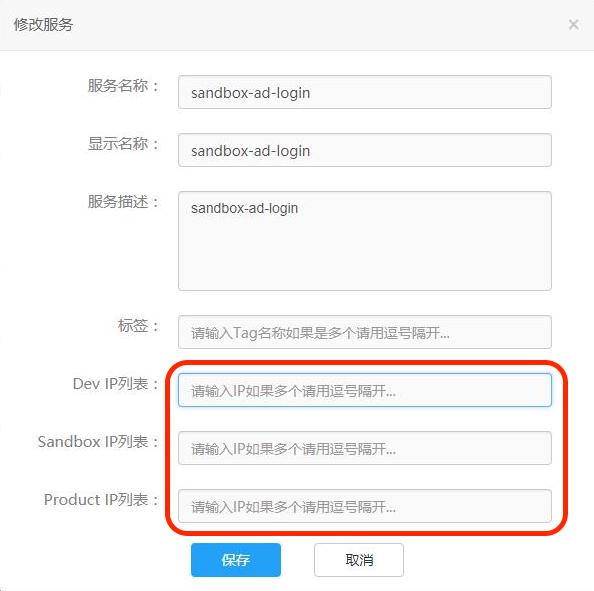
  

1.通过MSP构建及部署：

发邮件到msp@lenovo.com，包含以下内容：

	1）要发布的微服务的ServiceName、ServiceKey，及其所属应用的AppName、AppKey
	2）要发布的版本，项目在GitLab上的地址
	3）要发布的环境，及对应的IP及登录虚机的username、password
	4）发布原因、其他备注信息等
	
注意事项：

	1）请在本地构建完成并充分测试后再申请构建及部署，以避免频繁部署。
	2）在申请部署前，请务必完成代码提交环节。
	3）如果您的服务器在联想北研环境，由于安全策略的限制，服务器会被开启远程访问控制，即MSP的devops组件无法登录到您的服务器做相关的自动部署工作。因此需要将您的服务器开启到MSP的devops组件的远程访问权限。具体流程请咨询联想安全团队。


2.自行构建及部署：
		
注意事项：

	1）使用maven进行构建，需要构建为jar格式文件
	2）部署使用的虚机需要安装jdk环境
	3）运行：使用以下命令： 
	java -jar -Dserver.port=8082 servicename.jar --eureka.client.service-url.defaultZone=http://10.96.83.8:8761/eureka/
		# -Dserver.port:指定运行端口；
		# --eureka.client.service-url.defaultZon：指定服务注册服务器的地址，用来控制注册到哪个环境)
		


### <a name="service-update"></a>更新微服务/版本管理

微服务的版本更新请遵守以下MSP微服务版本号命名规范：

* 常规的版本号定义，分三项：<主版本号>.<次版本号>.<修订版本号>，如 1.0.0；
* 每次更新应单向递增，且可以互相比较，能够判断出最新的版本
* 需要将版本号同步修改到子pom文件的<version>字段，开发环境和测试环境以-SNAPSHOT结尾，如0.0.1-SNAPSHOT，生产环境不能加入SNAPSHOT后缀，如1.0.0。

版本号定义规则：

	主版本号(1)：当功能模块有较大的变动，比如增加多个模块或者整体架构发生变化。此版本号由项目决定是否修改。
	子版本号(1)：当功能有一定的增加或变化，比如增加了对权限控制、增加自定义视图等功能。此版本号由项目决定是否修改。
	阶段版本号(1）:一般是Bug修复或是一些小的变动，要经常发布修订版，时间间隔不限，修复一个严重的bug即可发布一个修订版。 

更新后的微服务按以下方式进行部署：

1.通过MSP构建及部署的微服务：
	
发邮件到msp@lenovo.com，包含以下内容：
	
	1）要更新的微服务的ServiceName、ServiceKey，及其所属应用的AppName、AppKey
	2）要更新的版本，项目在GitLab上的地址
	3）要更新的环境，及对应的IP及登录虚机的username、password
	4）更新原因、其他备注信息等。

2.自行构建及部署的微服务：
		
终止原服务的进程，再运行新版本的运行文件即jar包即可。


### <a name="service-offline"></a>下线微服务

微服务下线需要进行两部分的操作：1）停止服务  2）在MSP网站中删除微服务

注：如果您的微服务已被其他应用申请使用，将不能被删除。

1.通过MSP构建及部署的微服务：
	
发邮件到msp@lenovo.com，包含以下内容：
	
	1）要下线的微服务的ServiceName、ServiceKey，及其所属应用的AppName、AppKey
	2）要下线的版本，项目在GitLab上的地址
	3）要下线的环境，及对应的IP及登录虚机的username、password
	4）下线原因、其他备注信息等。

2.自行构建及部署的微服务：

终止原服务的进程即可。

### <a name="kibana-use"></a>kibana使用

## 简介
 Kibana是一个开源的分析与可视化平台，设计出来用于和Elasticsearch一起使用的。你可以用kibana搜索、查看、交互存放在Elasticsearch索引里的数据，使用各种不同的图表、表格、地图等kibana能够很轻易地展示高级数据分析与可视化。

## 语法
**单项term查询**

例: 搜 Dahlen， Malone

**字段field查询**

field:value   例：city:Keyport， age:26

**通配符**

? 匹配单个字符      例： H?bbs

* 匹配0到多个字符           例： H*

注意： ? * 不能用作第一个字符，例如： ?text    *text

**范围查询**

age:[20 TO 30]        age:{20 TO 30}

注：[ ] 表示端点数值包含在范围内，{ } 表示端点数值不包含在范围内

**逻辑操作**

AND     OR       例子：firstname:H* AND age:20          firstname:H* OR age:20

## 查询功能
我们进入kibana首页，可以看到Discover，Visualize，Dashboard等菜单，其实我们只需要关注这三个菜单就行了。首先，进入Discover页面，按照查询语法，查询相应的日志数据。
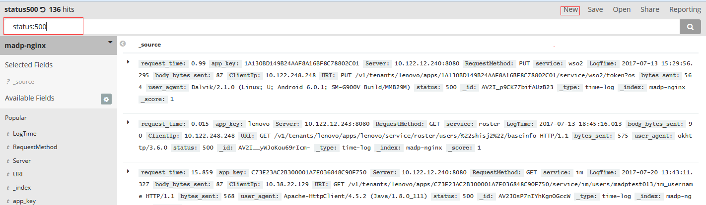

我们可以把一些常用的查询save保存。

## 视图功能

我们也可以把查询出来的数据制作成一些可视化的数据统计视图，进入Visualize页面，点击New按钮，可见如下页面。

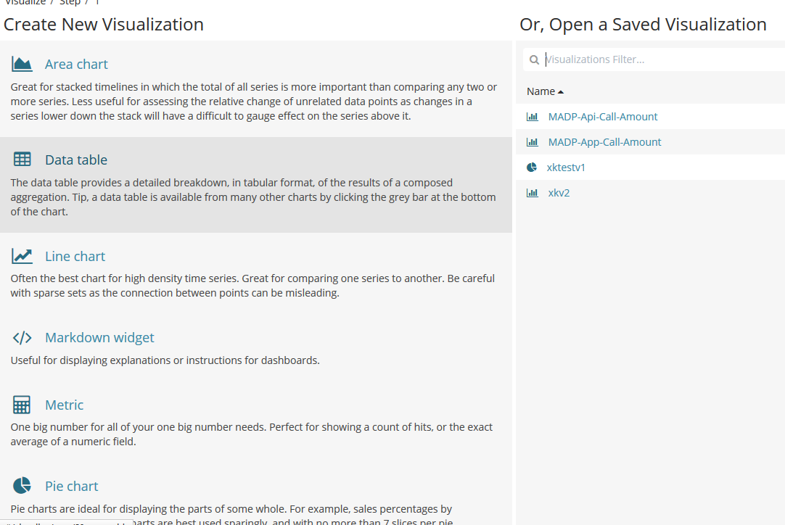

我们开发人员可以选择一种类型的视图类型，这里我们选择柱状图作为示例：

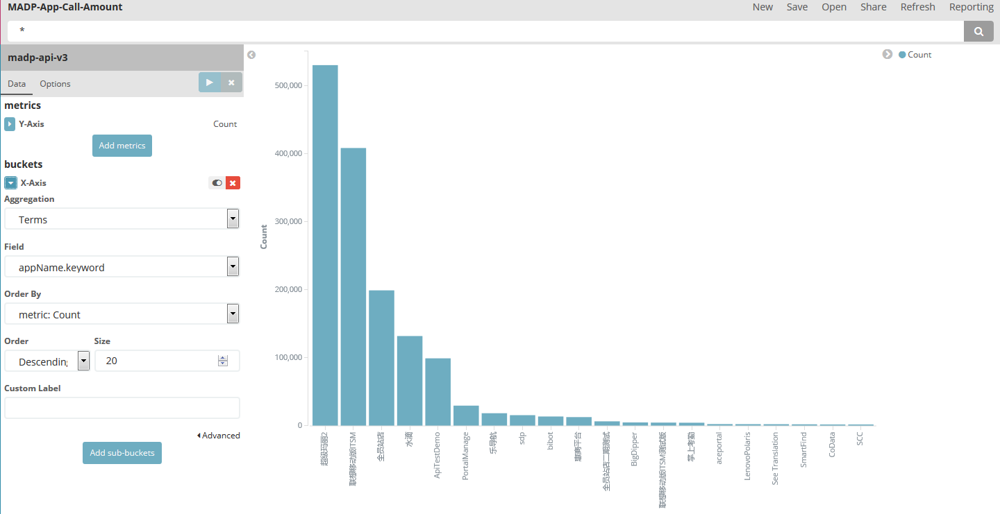

左侧分x轴和y轴，根据不同的字段可以组合出不同的展示形式，这个视图也可以点击save按钮保存起来，以备将来继续复用。

## 综合报表功能

我们学习了查询，并使用查询绘制出需要的视图，那么我们可以将一个或多个视图组合起来，便于业务人员进行汇总分析。
进入Dashboard页面，点击New按钮，我们可以看见之前保存的那些视图列表，如图

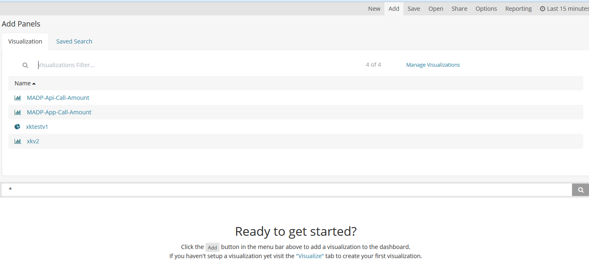

点击我们需要的视图，添加到dashboard中来，保存即可生成一个新的综合报表。


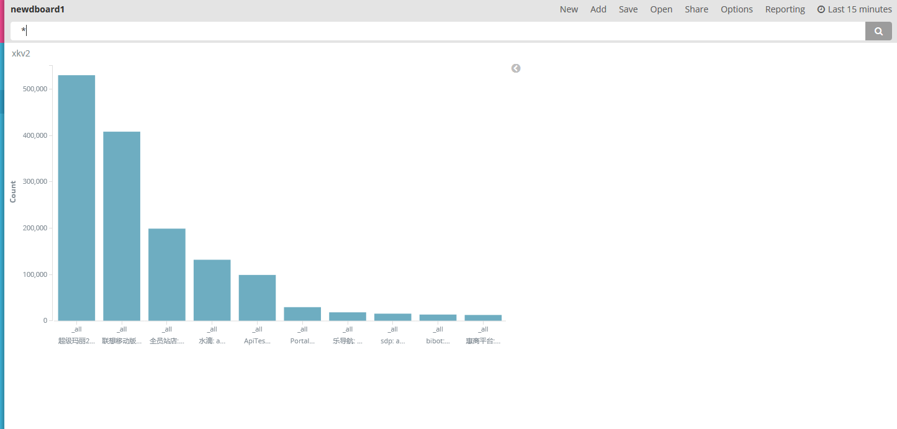


## 总结

至此，一个简单的dashboard我们就已经制作完成了。其实kibana还有很多强大的功能，各位小伙伴们可以发挥你们的探索精神和创造力，使这个工具更好的为我们的业务服务。

		
### <a name="service-monitor"></a>查看或监控微服务状态

Coming Soon!

### <a name="service-non-java"></a>对异构语言及非Spring Boot框架的支持

#### 背景

对于使用非java语言、或者非Spring Boot框架开发的微服务，如果您也需要注册到微服务平台并供其它开发者调用，那么可以通过引入sidecar-agent的代理机制来代理真正的服务。  

#### 实现

- 首先请去git上下载最新的msp-demo项目，[传送门](http://git.devops.lenovo.com/zhangyj21/msp-demo)

- 然后找到sidecarAgent这个子项目，打开并修改bootstrap.yml这个文件。您只需要修改2项配置：1）将spring.application.name配置修改为您所代理的微服务的服务名，2）将sidecar.port配置修改为已有服务部署的端口。如下图中所示：

	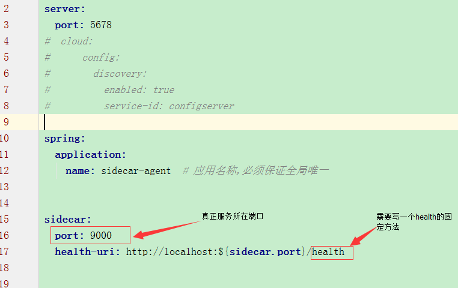

- **注：** 上图中sidecar.health-uri配置对应的是一个健康检查的接口，即需要您在原有服务的基础上创建并暴露这个接口，可参考sidecarProvider项目。示例代码如下:


``` java

	@GetMapping(value="health")
    public String healthCheck( ){

        String status = "{\\\"status\\\": \\\"UP\\\" }";
        
        return status;

    }

``` 

- 部署服务时，将sidecarAgent项目打好jar包，并需要在每个服务节点的服务器上部署该jar包，启动时指定好需要注册的eureka地址即可。命令为：

``` java
java -jar -Dserver.port=5678 sidecarAgent.jar --eureka.client.service-url.defaultZone=http://10.96.83.8:8761/eureka/

```


---


## <a name="call-doc"></a>微服务使用文档    [](#outline)


### <a name="service-apply"></a>申请微服务

在MSP网站的`应用服务`页，找到需要使用的微服务，点击申请。申请后，将会由微服务的拥有者进行审批，审批通过后您可以使用此微服务。关于某微服务的具体介绍，您可以参考下方的服务简介和API文档。


 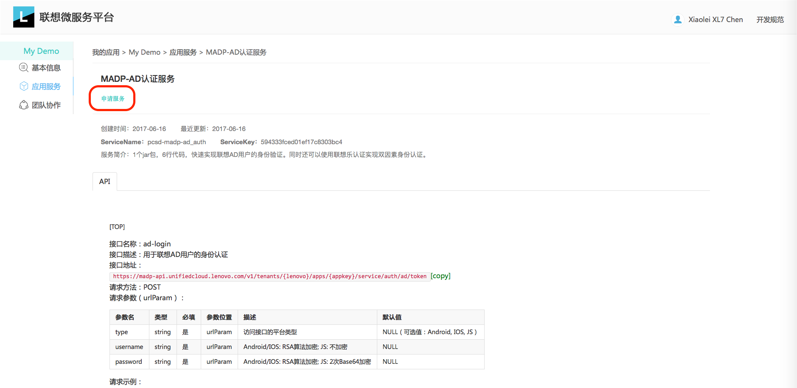


### <a name="service-call"></a>使用微服务

您可以通过两种方式调用已申请通过的微服务： 1）从应用的前端以http的方式调用 2）在开发的微服务中在服务端以服务间调用的方式调用

1.http调用

为了对其他开发者的微服务进行保护，通过http请求来调用已申请的微服务时，需要在Header中加入您的应用的身份信息及授权信息。

[点此查看](http://git.devops.lenovo.com/chenxl7/msp-userguide/blob/master/API-AuthMethod.md)微服务Http调用的认证方法

2.服务间调用

MSP平台的服务间调用推荐使用FeignClient来实现，通过FeignClient，你可以像调用本地方法一样，发送HTTP请求，来实现微服务间的调用。示例如下：

1）在子pom中引入feign依赖 

```yml
<dependency>
    <groupId>org.springframework.cloud</groupId>
    <artifactId>spring-cloud-starter-feign</artifactId>
</dependency>

```

2）注册feign客户端

```java
//加入注解，进行FeignClient的声明
@FeignClient(name="serviceNameWillCall")   
//实现接口类
public interface AppInfoClient{ 
	//设置请求的Header       
	@Headers("MSP-AppKey: {appkey}")   
	//指定要访问的该微服务下API的url，以及http方法、以及参数
	@RequestMapping(value = "/apps/{appID}" , method = RequestMethod.GET)  
	public String getAppInfo(@PathVariable("appID") String appID, @RequestHeader("MSP-AppKey") String appkey) ;
}
```

3）通过feign像调用本地方法一样调用微服务

```java

//装配上面实现的的接口类
@Autowired
private Tenants.AppInfoClient appInfoClient;

//在你的方法中调用接口类中的方法
public String showApp(@PathVariable String tenantID, @PathVariable String appID){

	...
    String appInfo = appInfoClient.getAppInfo(appID, "DDFD456ASFADFDS5AFDDSF");
	...

}


```


## <a name="help-doc"></a>帮助与支持

### 技术支持

* **QQ群:**  620856056
* **邮箱:**  msp@lenovo.com

### 技术博客

		Coming Soon！


